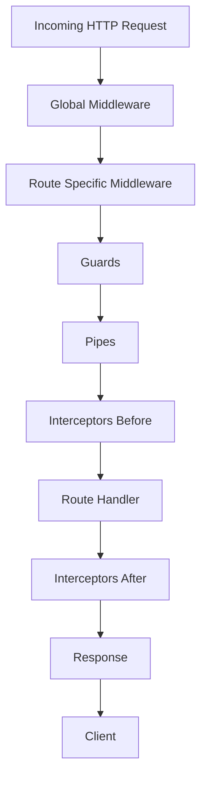

# Using Interceptors and Middleware in NestJS

A test repository demonstrating how to use interceptors and middleware in NestJS for logging, response transformation, and request preprocessing.

## Overview

This project implements:

- A **logging interceptor** that logs request and response data with execution time
- **Middleware** applied both globally (via `app.use()`) and to specific routes (via `MiddlewareConsumer`)
- **ClassSerializerInterceptor** for controlling serialisation with `@Exclude()` and `@Expose()` decorators

## Request Lifecycle Flow



## Installation

```bash
npm install
```

## Running the Application

```bash
npm run start:dev
```

The API will be available at `http://localhost:3000`.

## Endpoints

| Method  | Path         | Description                                  |
| ------- | ------------ | -------------------------------------------- |
| GET     | /            | Application info and available endpoints     |
| GET     | /items       | List all items                               |
| GET     | /items/:id   | Get one item by id                           |
| POST    | /items       | Create a new item                            |
| PUT     | /items/:id   | Update an existing item                      |
| DELETE  | /items/:id   | Delete an item                               |

## Example cURL Commands

List all items:

```bash
curl http://localhost:3000/items
```

Create an item:

```bash
curl -X POST http://localhost:3000/items \
  -H "Content-Type: application/json" \
  -d '{"name": "Test Item", "description": "A test description"}'
```

Get one item:

```bash
curl http://localhost:3000/items/1
```

Update an item:

```bash
curl -X PUT http://localhost:3000/items/1 \
  -H "Content-Type: application/json" \
  -d '{"name": "Updated Item", "description": "Updated description"}'
```

Delete an item:

```bash
curl -X DELETE http://localhost:3000/items/1
```

## Project Structure

- `src/main.ts` Bootstrap and global functional middleware
- `src/app.module.ts` Module configuration and route specific middleware
- `src/common/interceptors/logging.interceptor.ts` Logging interceptor
- `src/common/middleware/request-logger.middleware.ts` Route specific middleware
- `src/items/` Items CRUD with ClassSerializerInterceptor

## Interceptor vs Middleware

- **Middleware** runs early, before guards and interceptors. It operates on raw request/response objects.
- **Interceptors** run closer to the route handler, before and after it. They can transform both requests and responses.
